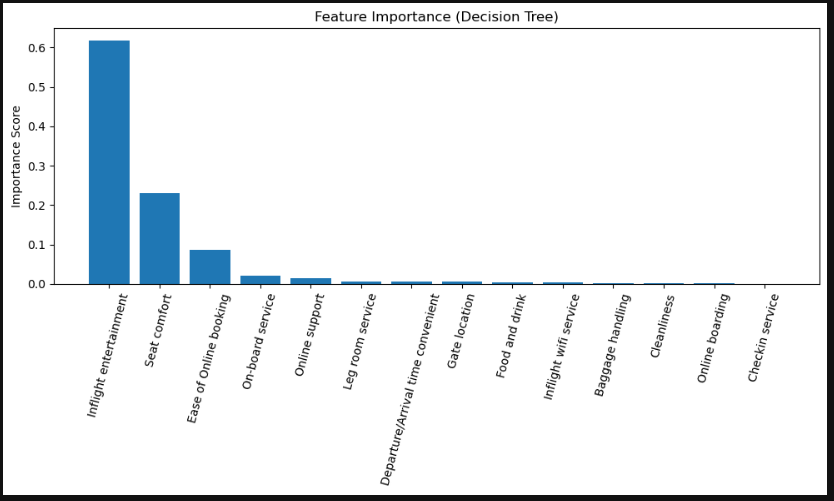

# Airline Customer Satisfaction Analysis

## 1. Project Overview

This project examines airline customer satisfaction using a dataset containing 129,880 passenger records and multiple service-related rating variables. The objective is to identify which operational service factors most strongly influence customer satisfaction. The analysis incorporates data preprocessing, exploratory analysis, correlation studies, and supervised machine learning through a Decision Tree Classifier.

The project identifies and ranks the most influential service factors—such as inflight entertainment, seat comfort, and ease of online booking—to support airlines in prioritizing improvements and enhancing customer experience.

---

## 2. Dataset Description

**File:** `Airline_customer_satisfaction.csv`

This dataset includes:

- Approximately 130,000 passenger entries  
- Service quality ratings (0–5) across multiple categories  
- Categorical variables including Gender, Customer Type, Type of Travel, and Class  
- A binary satisfaction label (converted from satisfied/dissatisfied to 1/0)  

The dataset supports both correlation-based and predictive modeling approaches to measure the relationship between service quality and customer satisfaction.

---

## 3. Tools and Libraries Used

The project was developed in Python using the following packages:

- `pandas` – Data cleaning and manipulation  
- `numpy` – Numerical operations  
- `matplotlib` – Data visualization  
- `seaborn` – Statistical visualization and heatmaps  
- `scikit-learn` – Machine learning modeling (Decision Tree Classifier)

The complete analysis is available in the Jupyter Notebook:  
**`Final Code.ipynb`**

---

## 4. Setup Instructions

### 4.1. Requirements

Ensure the following are installed:

- Python 3.8 or newer  
- Jupyter Notebook or JupyterLab  
- pip package manager  

### 4.2. Install Dependencies

Run the command below to install required libraries:

```bash
pip install pandas numpy matplotlib seaborn scikit-learn
```

### 4.3. Running the Project

1. Download or clone the project folder containing:
   - `Final Code.ipynb`
   - `Airline_customer_satisfaction.csv`

2. Launch Jupyter Notebook:
   ```bash
   jupyter notebook
   
3. Open **Final Code.ipynb**.

4. Confirm that the dataset file is in the same directory as the notebook.

5. Run all notebook cells sequentially.

---

## 5. Methodology Summary

### 5.1. Data Cleaning
- Filled missing values in “Arrival Delay in Minutes” using the dataset median.  
- Converted the satisfaction column into a numeric binary variable (`satisfaction_num`).

### 5.2. Exploratory Data Analysis
- Reviewed dataset structure, column types, and missing values.  
- Explored satisfaction distribution across different flight classes.

### 5.3. Correlation Analysis
- Calculated correlations between service ratings and satisfaction.  
- Produced correlations for:
  - Overall dataset  
  - Economy Class  
  - Eco-Plus Class  
  - Business Class  

### 5.4. Decision Tree Modeling
- Built a Decision Tree Classifier using selected service rating features.  
- Divided the dataset into training (75%) and testing (25%) subsets.  
- Evaluated model performance (approx. 87% accuracy).  
- Extracted feature importance metrics to identify key drivers of satisfaction.  
- Visualized the decision tree for interpretability.

### 5.5. Key Findings
- Inflight entertainment is the most influential factor in predicting customer satisfaction.  
- Seat comfort and ease of online booking also show strong predictive importance.  
- Several other service variables, such as baggage handling and gate location, have minimal influence.



---

## 6. Team Contributions

This project was completed collaboratively by all team members. Contributions are summarized below:

### Mohammad Shah
- Initial coding and early-stage data processing  
- Developed presentation content
- Contributed and finalized the written project report  

### Abdul Wasay
- Initial and finalized coding 
- Developed presentation content  
- Contributed and finalized the written project report  

### Faria Akther
- Developed presentation content   
- Contributed to the written report  

### Sumandeep Kaur
- Developed presentation content  
- Contributed to the written report  


